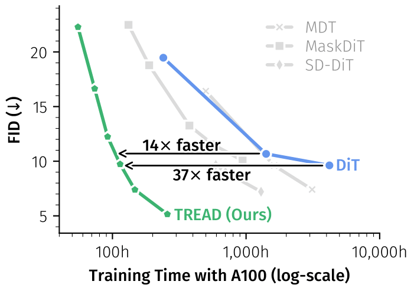

<h2 align="center">👟TREAD: Token Routing for Efficient Architecture-agnostic Diffusion Training</h2>
<div align="center"> 
  <a href="https://x.com/felix_m_krause" target="_blank">Felix Krause</a> · 
  <a href="" target="_blank">Timy Phan</a> · 
  <a href="" target="_blank">Ming Gui</a> · 
  <a href="https://stefan-baumann.eu/" target="_blank">Stefan Baumann</a> · 
  <a href="https://taohu.me" target="_blank">Vincent Tao Hu</a> · 
  <a href="https://ommer-lab.com/people/ommer/" target="_blank">Björn Ommer</a>
</div>
<p align="center"> 
  <b>CompVis Group @ LMU Munich</b> <br/>
</p>

[](https://arxiv.org/pdf/2501.04765)
[](https://compvis.github.io/tread/)

This repository contains the official implementation of the paper "TREAD: Token Routing for Efficient Architecture-agnostic Diffusion Training".

We propose TREAD, a new method to increase the efficiency of diffusion training by improving upon iteration speed and performance at the same time. For this, we use uni-directional token transportation to modulate the information flow in the network.

<div align="center">
  
</div>

## 🚀 Training

In order to train a diffusion model, we offer a minimalistic training script in `train.py`. In its simplest form it can be started using:

```python
accelerate launch train.py model=tread
```

or

```python
accelerate launch train.py model=dit
```

with `configs/config.yaml` having all the relevant information and settings for the actual training run. Please adjust this as needed before training.
`Note:` We expect precomputed latents in this version.
Under `model` one can decide between `dit` and `tread` which are the preconfigured versions here with the former being the standard dit and the latter being supported by TREAD. How these changes are implemented can be seen in `dit.py` and `routing_module.py`.

In our paper, we show that TREAD can also work on other architectures. In practice, one needs to be more careful with the routing process in order to adhere to the characteristics of the specific architecture as some have a spatial bias (RWKV, Mamba, etc.). For simplicity, we only provide code for the Transformer architecture as it is the most widely used while being robust and easy to work with.

## 🖼️ Sampling

For most experiments we use the [EDM](https://github.com/NVlabs/edm) training and sampling to stay consistent with prior art, and the FID calculation is done via the [ADM](https://github.com/openai/guided-diffusion) evaluation suite. We provide a `fid.py` to evaluate our models during training using the same reference batches as ADM.

## 💥 Guiding TREAD
[](https://arxiv.org/abs/2601.01608)
[](https://compvis.github.io/sparse-guidance/)


TREAD works great during _training_! How about _inference_? \
It turns out TREAD can be applied during guided inference as well to gain additional performance and reduce FLOPS at the same time! \
Instead of dropping the class label (CFG), we can guide with a selection rate delta. Since TREAD's selection rate (0.5) generalizes to other rates, this can be tuned in inference-time only.

We demonstrate this in `rf.py` which contains minimal flow matching code for training and sampling:

`sample`: normal sampling\
`sample_tread`: TREAD sampling 🔥

## 🎓 Citation

If you use this codebase or otherwise found our work valuable, please cite our paper:

```bibtex
# TREAD (ICCV 2025)
@InProceedings{krause2025tread,
    author={Krause, Felix and Phan, Timy and Gui, Ming and Baumann, Stefan Andreas and Hu, Vincent Tao and Ommer, Bj\"orn},
    title={TREAD: Token Routing for Efficient Architecture-agnostic Diffusion Training},
    booktitle={Proceedings of the IEEE/CVF International Conference on Computer Vision (ICCV)},
    month={October},
    year={2025},
    pages={15703-15713}
}

# Sparse Guidance (Preprint 2026)
@misc{krause2026guidingtokensparsediffusionmodels,
      title={Guiding Token-Sparse Diffusion Models},
      author={Felix Krause and Stefan Andreas Baumann and Johannes Schusterbauer and Olga Grebenkova and Ming Gui and Vincent Tao Hu and Bj\"orn Ommer},
      year={2026},
      eprint={2601.01608},
      archivePrefix={arXiv},
      primaryClass={cs.CV},
      url={https://arxiv.org/abs/2601.01608}, 
}
```

## Acknowledgements

Thanks to the open source codebases such as [DiT](https://github.com/facebookresearch/DiT), [MaskDiT](https://github.com/Anima-Lab/MaskDiT), [ADM](https://github.com/openai/guided-diffusion), and [EDM](https://github.com/NVlabs/edm). Our codebase is built on them.
